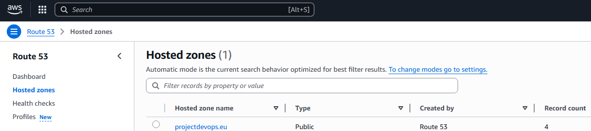
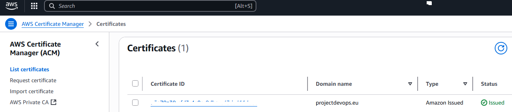
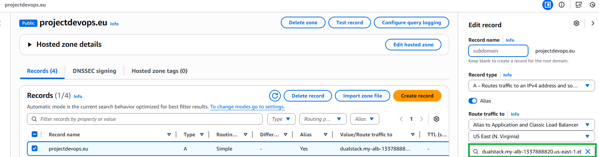

# 🚀 ECS Fargate Starter

A Terraform-based infrastructure starter project for deploying containerized applications to AWS ECS using Fargate.  
Designed as a simple, production-ready skeleton with HTTPS and modular components.

---

## ✅ What’s included?

| Component       | Description |
|------------------|-------------|
| **Terraform**     | Modular infrastructure definition |
| `modules/vpc`     | VPC with public subnets |
| `modules/lb`      | Application Load Balancer with HTTPS |
| `modules/sg`      | Security Groups |
| `modules/iam`     | IAM roles and policies for ECS tasks |
| `modules/ecs`     | ECS Fargate service (supporting multiple services via `locals`) |
| `modules/route53` | Optional DNS zone management |
| `lab.auto.tfvars` | Example configuration with domain and certificate |

---

## 🔧 Prerequisites

To run this project, you’ll need:

1. A registered domain in **Route 53** (hosted zone) use your domain name (projectdevops.eu is my bought domain on GoDaddy)  

2. An existing **ACM certificate** in `us-east-1` (required for HTTPS via ALB)

3. **AWS credentials** configured in your environment  
   Either set the following environment variables:

```bash
export AWS_ACCESS_KEY_ID="your-access-key"
export AWS_SECRET_ACCESS_KEY="your-secret-key"
export AWS_DEFAULT_REGION="us-east-1"
```
.
.
.
.
.
.
.
.
.
.
.
.
.
.
## ARTICLE  #########################################################################################################

🚀 How I Built a Production-Ready ECS Fargate Platform (with Terraform, ALB & Path-Based Routing)

In this post, I’ll show you how I built a modular, production-ready infrastructure platform using Terraform, AWS ECS with Fargate, ACM/HTTPS, and path-based routing via ALB — in a way that anyone can clone, customize, and deploy in minutes.

You’ll get the full free project, including code, architecture, and a working deployment example — and I’ll show you what’s in the PRO version, for those who want staging environments, CI/CD pipelines, and production-grade secrets and monitoring.

🧠 What Is This Project?

It’s a starter kit for launching multiple containerized apps on AWS ECS Fargate with a single ALB and domain — using Terraform only.

Each app is automatically routed via path-based routing:

https://yourdomain.com/streamlit1  
https://yourdomain.com/streamlit2  

The whole platform is:  
-Modular (VPC, ECS, ALB, IAM, Route53 modules)  
-Fast to deploy (Terraform only, no manual AWS Console clicking)  
-HTTPS by default (with ACM certificate) 
-Designed for multiple services from the start  
-Use public container registry dockerhub (no need for ECR)
-Provide local terraform block to simple adding new paths

🏗️ Architecture Overview  
The stack includes:  
-VPC with public/private subnets 
-ALB with https listeners  
-Security groups  
-Ecs cluster with services defined in locals {}  
-Iam roles for fargate  
-local block in tfvars to simple added new services  
    -creates under the hood all necessary AWS Services  


⚙️ How It Works  
1.) Clone the repo and set up lab.auto.tfvars with your domain and ACM cert ARN <<< prerequisuite required to be added on your side  
2.) Define your services in the locals block:  
```
locals {
  services = {
    app1 = { cpu = 256, memory = 512, image = "jkb91/stramlitapp1:latest" },
    app2 = { cpu = 512, memory = 1024, image = "jkb91/stramlitapp2:latest" }
  }
}
```
3.) Run terraform init && terraform apply  
Your apps will be deployed to /app1, /app2, etc.  

4.) The last manual thing after deployment is to switch on hosted zone and RECORD A to connect "alias" of your ALB  


5.) Try to add and see what happens if you uncomment this block  
```
  # ,
  # {
  #   task_definition = {
  #     container = {
  #       name                 = "streamlit2" # USED ALSO AS PATH >>> DOMAIN/nginx2 >>> CONTAINER IMAGES HAS TO SET THAT TOO
  #       image_tag            = "jkb91/stramlitapp2:latest"
  #       container_port       = 8501
  #       healthcheck_path     = "http://localhost:8501/streamlit2" # REQUIRED HEALTH PATH
  #       stream_prefix        = "proxy"
  #       elb_healthcheck_path = "/streamlit2"
  #     }
  #     config = {
  #       family = "task-definition-app2"
  #       cpu    = "256"
  #       memory = "512"
  #     }
  #   }
  #   service_name  = "service-2"
  #   replica_count = 1
  # }
```
  6.) Images used in this projects are build based on streamlit , you can find Dockerfile in streamlit folder  
  Take a look that each new app you want to add has to be explictly server behind path like DOMAIN/new_app  
  Example from Dockerfile for both images  


  First container works under DOMAIN/streamlit1
```
    ["streamlit", "run", "app.py", \
     "--server.port=8501", \
     "--server.baseUrlPath=streamlit1"]
```
  Second container works under DOMAIN/streamlit2

```
    ["streamlit", "run", "app.py", \
     "--server.port=8501", \
     "--server.baseUrlPath=streamlit2"]
```

